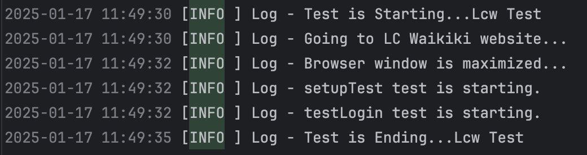

# LC Waikiki E-Ticaret Test Otomasyonu

## Proje Hakkında

Bu proje, LC Waikiki e-ticaret platformunda belirlenen bir kullanıcı senaryosunun otomasyonunu gerçekleştirmek için oluşturulmuştur. Projede Page Object Model (POM) tasarım deseni kullanılarak test kodlarının okunabilirliği ve sürdürülebilirliği artırılmıştır.

## Kullanılan Teknolojiler

- **Programlama Dili:** Java
- **Test Framework:** TestNG
- **Web Otomasyon Aracı:** Selenium
- **Build Aracı:** Maven
- **Raporlama Araçları:** Allure Report ve ExtentReports
- **Loglama:** Log4j 2

## Projede Kullanılan Bağımlılıklar

Proje içerisinde kullanılan bağımlılıkları görmek için `pom.xml` dosyasını inceleyebilirsiniz.

## Test Senaryosu

- [LC Waikiki](https://www.lcw.com) sitesine gidilir.
- "Giriş Yap" butonuna tıklanır.
- Geçerli bir e-posta ve şifre kullanılarak giriş yapılır.
- Çocuk & Bebek > Kız Çocuk (6-14 Yaş) > Mont ve Kaban kategorisi seçilir.
- Filtreleme işlemleri gerçekleştirilir:
  - Beden: 5-6, 6, 6-7 yaş
  - Renk: Bej
- Ürünler "En Çok Satanlar" sırasına göre sıralanır.
- İlk sıradaki 4. ürüne tıklanarak ürün detay sayfasına gidilir.
- Bedeni tükenmemiş bir ürün seçilerek sepete eklenir.
- Sepetim ekranına gidilir.
- Sepette ürün adeti 1 artırılır.
- Sepetim ekranında şu doğrulamalar yapılır:
  - Ürün adı, rengi ve adedi
  - Ürün tutarı ile toplam ödeme tutarının eşleşmesi
- Ürün kartı üzerinde yer alan kalp simgesine tıklanarak ürün favorilere eklenir.
- Favorilerim ikonuna tıklanır ve favorilerim ekranı açılır.
- Favorilerim ekranında ürünün listelendiği ürün adı eşleştirme yöntemi ile doğrulanır.
- Sepetim ekranına gidilir ve "Ödeme Adımına Geç" butonuna tıklanır.

## Proje Yapısı

```
com.lcwAutomation/
├── .idea/
├── allure-results/
├── ExtentReports/
│   └── ExtentReportResults.html
├── logs/
│   └── app.log
├── pictures/
│   └── log.png
├── src/
│   ├── main/
│   │   ├── java/
│   │   │   ├── pages/
│   │   │   │   ├── BasePage.java
│   │   │   │   ├── CartPage.java
│   │   │   │   ├── FavoritesPage.java
│   │   │   │   ├── HomePage.java
│   │   │   │   ├── LoginPage.java
│   │   │   │   ├── ProductDetailPage.java
│   │   │   │   └── ProductsPage.java
│   │   │   └── utilities/
│   │   │       └── Log.java
│   │   └── resources/
│   │       └── log4j2.xml
│   └── test/
│       ├── java/
│       │   ├── screenshotsTest/
│       │   │   └── ScreenshotsTest.java
│       │   ├── tests/
│       │   │   ├── BaseTest.java
│       │   │   ├── CartTest.java
│       │   │   ├── FavoritesTest.java
│       │   │   ├── HomePageTest.java
│       │   │   ├── LoginTest.java
│       │   │   ├── ProductDetailTest.java
│       │   │   └── ProductsTest.java
│       │   └── utils/
│       │       ├── extentReports/
│       │       │   ├── ExtentManager.java
│       │       │   └── ExtentTestManager.java
│       │       └── listeners/
│       │           ├── Retry.java
│       │           └── TestListeners.java
│       └── resources/
│           └── screenshots/
│               └── lcwimage.png
└── target/
├── .gitignore
├── pom.xml
└── README.md

```
## Nasıl Çalıştırılır?

- **Proje Depolanması ve Yapılandırılması**

    - Bu projeyi bilgisayarınıza klonlayın:
      ```bash
      git clone <proje-repo-linki>
      ```
    - Bir IDE (IntelliJ IDEA, Eclipse vb.) ile projeyi açın.
    - Gerekli bağımlılıkları yüklemek için Maven'i kullanın:
      ```bash
      mvn clean install
      ```

- **Test Konfigürasyonu**

    - `src/main/resources/log4j2.xml` dosyasını kontrol edin ve gerektiğinde log seviyelerini düzenleyin.
    - Test senaryolarında kullanılacak e-posta ve şifre bilgilerini güvenli bir şekilde  test metotlarına ekleyin.

- **Testleri Çalıştırma**  

   komut satırından çalıştırın:
   ```bash
    mvn test
     ```

- **Test Raporları**

    - Allure raporlarını oluşturmak için aşağıdaki komutu çalıştırın.
      ```bash
      allure serve allure-results
      ```
    - ExtentReports HTML dosyasını görüntülemek için:
   
        - `ExtentReports/ExtentReportResults.html` dosyasını bir tarayıcıda açabilirsiniz.

- **Ekran Görüntüsü ve Loglar**

    - Test sırasında alınan ekran görüntüleri `src/test/resources/screenshots/` klasörüne kaydedilir.
    - Log dosyalarını `logs/app.log` dosyasından kontrol edebilirsiniz.

## Loglama (Log4j 2) Kullanımı

Bu projede, test süreçlerinin loglanması için Log4j 2 kullanılmıştır. Log4j 2, testlerin başlangıç ve bitiş zamanlarını, test sırasında oluşan hata ve uyarıları kaydetmek amacıyla yapılandırılmıştır.

- **Yapılandırma Dosyası**

Proje içerisinde **log4j2.xml** yapılandırma dosyası bulunmaktadır. Bu dosya, logların nasıl ve nereye yazılacağını belirleyen ayarları içerir.

- **Log4j 2 Yardımcı Sınıfı**

Loglama işlemleri için **utilities.Log** sınıfı oluşturulmuştur. Bu sınıf içerisine yazılan metotlarla test süreçleri loglanır.

- **BaseTest Sınıfında Kullanım**

Loglama işlemleri **BaseTest** sınıfında kullanılmıştır. Testlerin başlangıç ve bitişinde tarayıcı başlatıldığında ve ana sayfaya gidildiğinde loglar yazdırılmaktadır.

- **Test Çalışma Logları (app.log)**

Aşağıda **LoginTest** çalıştırılması sonrasında **app.log** dosyasına yazdırılan log bilgileri yer almaktadır. 



## Ekran Görüntüsü Alma

Bu projede, Selenium WebDriver kullanılarak web sayfalarının ekran görüntüleri alınmakta ve test sırasında mevcut tarayıcı penceresinin tamamı kapsanarak kaydedilmektedir.

- TakesScreenshot arayüzü ile alınan ekran görüntüsü şu dosya yoluna kaydedilir:

  **`src/test/resources/screenshots/lcwimage.png`**  

## Extent Reports Kullanımı

Bu projede, testlerin görsel ve detaylı raporlanabilmesi için ExtentReports kullanılmıştır. Bu kütüphane, testlerin durumunu (başarı, başarısızlık, atlanmış vb.) adımlarını içeren anlaşılır HTML raporları oluşturur. Her testin başarı durumu, log seviyeleri, tarih, saat gibi detaylar da rapor içinde yer alır.

- **Raporların Konumu**

Raporlar, `ExtentReports/ExtentReportResults.html` dosyasına kaydedilir. Bu dosyayı herhangi bir web tarayıcısında açarak testlerin durumu ve detaylı bilgilerini inceleyebilirsiniz.

## Allure Report Kullanımı

Bu projede, testlerin görsel ve detaylı bir şekilde raporlanabilmesi için Allure Report kullanılmıştır. Allure, testlerin başarı, başarısızlık ve atlanma durumlarını HTML formatında sunarak, test senaryolarını daha anlaşılır hale getirir.

- **Test Anotasyonları**: Test kategorisi, özellik, açıklama, önem seviyesi, hikaye ve adım gibi bilgileri belirtmek için anotasyonlar kullanılır.

- **Test Dinleyici (Listener)**: Testlerin başlangıç, bitiş ve sonucu hakkında bilgi toplamak için **TestListeners** sınıfı kullanılır. Test başarısız olduğunda ekran görüntüleri alınır ve hata mesajları kaydedilir.

- **Raporların Konumu**: Raporlar `allure-results` klasöründe depolanır. Raporu görüntülemek için aşağıdaki komutu kullanabilirsiniz:
   ```bash
   allure serve allure-results
    ```

## Sonuç

Bu proje, LC Waikiki e-ticaret platformunda belirlenen kullanıcı senaryolarının başarıyla otomasyona dönüştürülmesini sağlamıştır. Kullanılan teknolojiler ve yöntemler testlerin doğru bir şekilde çalışmasını ve detaylı raporlar oluşturulmasını sağlamaktadır.


